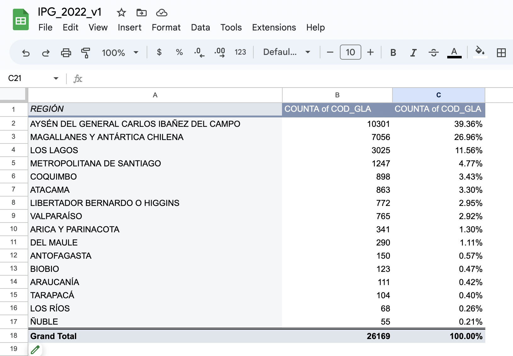
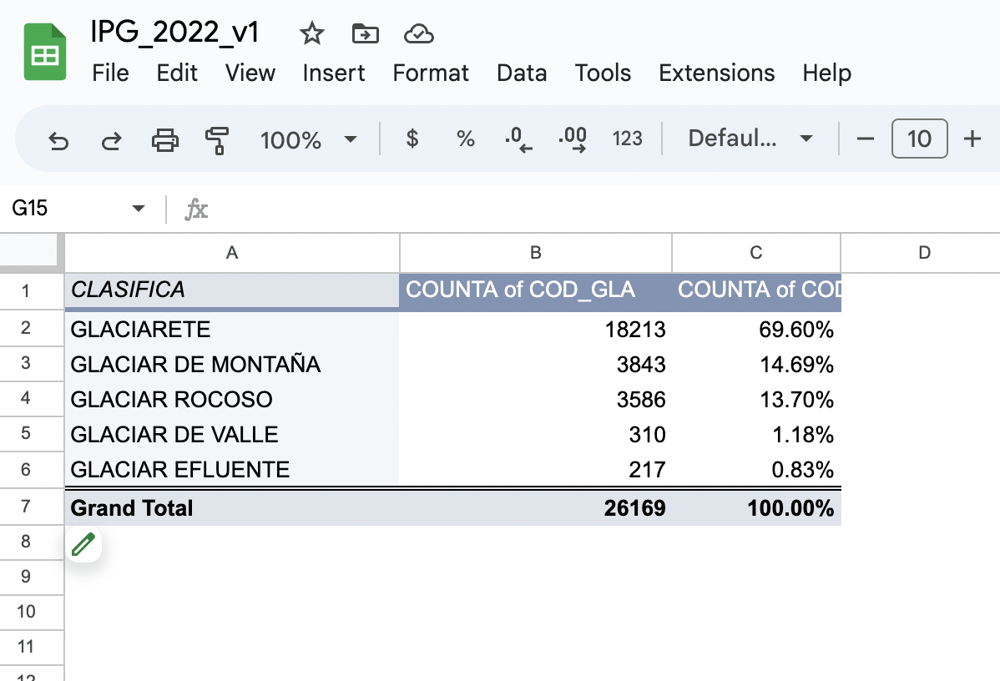
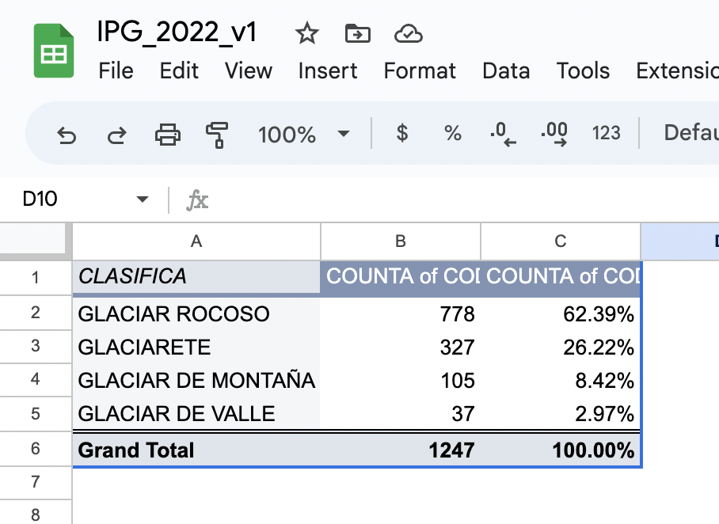
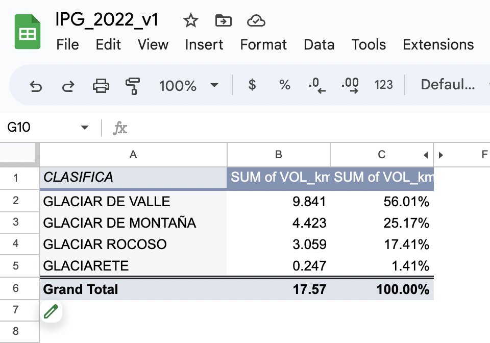
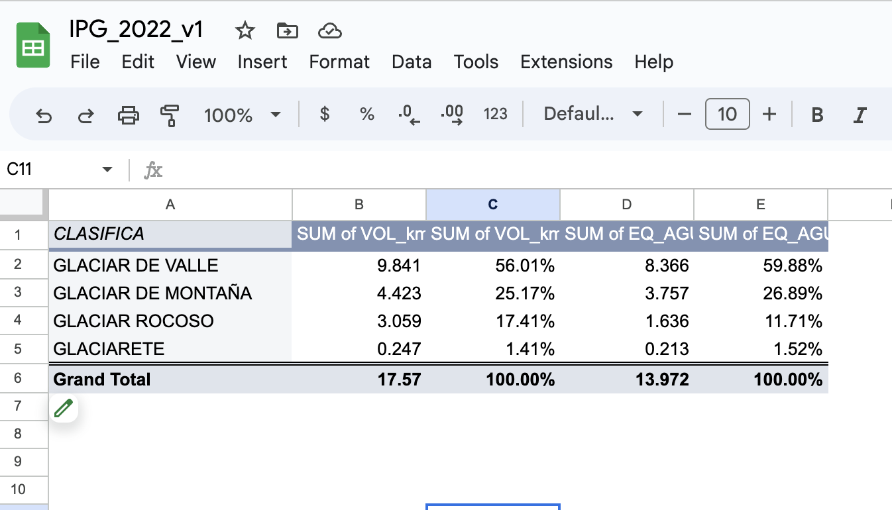

# J296 Final Project
# As Glaciers Melt in Chile’s Central Andes, Environmentalists Race to Protect them from Mines
## Laura Isaza
### As Glaciers Melt in Chile’s Central Andes, Environmentalists Race to Protect them from Mines

Central Chile is projected to face severe water scarcity in the coming decade. A megadrought that has lasted for over a decade, an unprecedented length of time, threatens to continue depleting the region’s water supply. The region’s 1247 glaciers have provided respite over the course of the drought, but glaciers continue to recede with rising temperatures, diminishing the water flowing through the region’s waterways. Mining, the backbone of Chile’s economy, when combined with climate change, poses a dual threat to the region’s glaciers. The town of El Alfalfal, residents say they are living the impacts of the drought first hand.  Still, they oppose an environmental movement in the region launched in 2019 to protect the region’s glaciers fearing that the urban-led campaign will wash away their way of life. 

In 2019, environmentalists launched “Queremos Parque”, a campaign to transform 142 thousand hectares of land into a national park. The organization views their campaign as a race against Chile’s mining industry for control over the land. The launch aligned with the announcement of the return of the 142 thousand hectares from the military to Bienes Nacionales, the ministry that manages public lands. It had been seized during the US-backed military dictatorship of Augusto Pinochet in 1975. With the land back in public hands, Queremos Parque wants to ensure it stays out of the hands of the mining industry. 

“Democratizing access to nature is very important,” said Pilar Valenzuela Delpiano, Director for Queremos Parque, ““In general, the environmental movement is one driven by the elites because nature access is for the elites.” She believes that creating easily-accessible ecotourism for Santiago’s city dwellers could foster a broader culture of caring for nature. 

According to Glaciologist Francisco Ferrando Acuña, former vice president of the Chilean Society of Geographical Sciences, “the most obvious way to protect glaciers is to prevent activity, direct or indirect, on them.” To Ferrando and other scientists, the biggest threat to the Olivares glacier field– which contributes most of the water provided by glacial melt in the region– is mining.

There are two primary types of glaciers, and mining impacts both. “Uncovered glaciers” are visible swaths of ice, often recognized by their gleaming presence on the tops of mountains and in shaded valleys. Mountain and valley glaciers, as well as glaciers, all make up this category of “uncovered glaciers.” Rock glaciers, on the other hand, are hidden pockets of ice, often undetectable to the naked eye. Rock glaciers make up roughly 62% of the region’s 1247 glaciers, but Ferrando says the largest volume of stored water is held by uncovered glaciers, which are the most susceptible to melt from rising temperatures and mining. 

<!script type="text/javascript" defer src="https://datawrapper.dwcdn.net/eHFF3/embed.js?v=1" charset="utf-8"></script><noscript></noscript>

Recent research has demonstrated that the melting rates of the region’s fastest-melting glacier have been directly attributed to black carbon from the nearby Los Bronces copper mine. Since the beginning of the megadrought, this increased melt from glaciers has provided relief to drinking and irrigation water supply in the absence of rain and snow. But the peak of glacial contributions to water supply already passed, over 50 years ago. Scientists estimate, in about a century, these glaciers will be gone. 

Even distant mining operations can have an effect on glaciers and air quality, Ferrando says. Winds in the area, whipping up to 120 km per hour, can send millions of particles of pulverized rock, dust, and combustion soot, known as black carbon, dozens of kilometers. These contaminants land wherever the wind takes them, including high mountain peaks, muddying once-pristine ice, damaging glaciers’ reflectivity, and beckoning the heat of the sun.  

The activity of the mine generates heat, too. Heavy machinery, encampments, and mining installations in the high mountains are some of the sources of “thermal combustion” processes that melt the ice in the surrounding area. 

“Mining has a hold over Chile’s politics,” says Kate Altemus Cullen, a 28-year-old Ph.D. candidate in the University of California Energy and Resources Group, who studies water resources in Chile. According to Cullen, Pinochet-era instability left a legacy of copper dependency, which provides over 20% of the country’s wealth and has become the base of Chile’s economy. Even as the country renegotiates water rights to favor drinking water security, Kate says the government favors mines over scientific evidence of their harmful effects.

“It’s an existential threat,” says Cullen, thinking of the water. “It’s pretty dire to think about, where would the water come from?” 

Valenzuela Delpiano wants to safeguard water access by declaring the land a protected zone. But she has faced opposition from within the localities of El Alfalfal and Los Maitenes that are within the former military land, and thus are within the boundaries of the imagined protected land. Locals there worry that their animal rearing practices would be threatened by the influx of tourists and restrictions on grazing areas that would come with the reserve. 

Miguel Aguirre Ortega, who was born and raised in El Alfalfal, said,  “It might all sound like a beautiful idea, like a dream,” he says. “But it is not going to be that way for the people who live here.” He and others from his community see Queremos Parque as a threat that could prevent them from passing traditional herding along to the next generation. “Many of the animals, as I understand it, would have to go,” he says.

Locals also worry about what an influx of tourists would mean for the quiet respite of the mountains. While Queremos Parque sees a reserve as an opportunity to safeguard the community’s traditions while helping bring additional income, local goat herder Jesus Carrasco said, “I don’t want sacks full of money if it means losing the peace that I have here.” He would rather things stay the way they are. 

Still, Carrasco noted that the drought is already changing the patterns of daily life. He has to take his goats higher into the mountains yearly, bringing them closer to the source of water, where vegetation is less scarce. For other Alfalfal residents, change has come in the form of working multi-week shifts in copper mines in the north to have financial stability they can no longer rely on their animals for. Nonetheless, they do not trust that the urban movement will follow through on promises that they will be able to stay on the land. Queremos Parque has only met with them three times since the launch of their campaign. 

Still, Queremos Parque is trying to convince the locals to support the campaign, to gain traction with the government at the municipal and national levels. The possibility of expanded mining operations looms over the region. All the while, the megadrought is drying up the landscape, which continues to pose challenges to animal rearing practices. The only certain thing is that the future means change. 

********************

## Data Analysis Process
Download Chile’s national glacier inventory at https://dga.mop.gob.cl/Paginas/InventarioGlaciares.aspx. It is the “mapoteca” link. It will download a ZIP folder to your computers. There, you will find the dataset and the data library to understand each category in the dataset. Note that everything is in Spanish. 
Upload the dataset to Google Drive as a .csv file. 

**Question 1:
How many of Santiago’s glaciers are in the Metropolitan Region? What is the total value, and the value as a percentage of the total glaciers in Chile?**
1. Create a pivot table from the original dataset. Select the “row” value as “region.” This will list every one of Chile’s 16 regions. 
2. Add “value” as “COD_GLA.” From your data library, you will know that this variable represents an original code assigned to every glacier in the inventory. Ask it to show the value as a count of “COD_GLA.” This will show you the total number of glaciers per region in Chile. 
3. Bonus if you sort by largest to smallest to see which region contains the most glaciers. You can sort by selecting the dropdown under “order” in the “row” section and clicking “descending;” under “Sort by” select “count A.” 
4. Repeat the Step 2, but instead of selecting “count” of “COD_GLA,” select “as a percent of grand total” to see what percentage of the country’s total glaciers are in each region. 

**Results:** As shown, Aysen has the highest rate of glaciers, followed by Magallanes and Los Lagos. This is expected, as they are the regions furthest South. But several regions north, the Santiago Metropolitan Region comes in as the region with the 4th most glaciers in the country. It has 1247 glaciers, that make up 4.77% of Chile’s total number of glaciers. 

**Question 2:
How many of each type of glacier are there in Chile? For each, what is the value as a percent for the total number of glaciers in Chile?**

1. Create a Pivot Table from the original data set.
2. Create a pivot table from the original dataset. Select the “row” value as “Clasifica.” This will list every type of glacier (there are 5). 
3. Add “value” as “COD_GLA.” Ask it to show the value as a count of “COD_GLA.” This will show you the total number of glaciers per type in Chile. 
4. Sort them in descending order. 
5. Repeat the second step, but instead of selecting “count” of “COD_GLA,” select “as a percent of grand total” to see what is the percent breakdown of each type of glacier in Chile. 

**Results:** As depicted above, the most common type of glacier in Chile is the glacieret. Glacierets are the smallest type of glacier and are typically abundant. They’re followed by Mountain glaciers, rock glaciers, valley glaciers, and outlet glaciers. 

**Question 3
Let’s see if the breakdown of types of glaciers in the Santiago Metropolitan Region reflects that of the nation as a whole.** 
1. Create a pivot table.
2. Filter by region and select only the Santiago Metropolitan Region. 
3. Select “Clasifica” to get a unique row for each type of glacier. 
4. Add “value” as “COD_GLA.” Ask it to show the value as a count of “COD_GLA.” This will show you the total number of glaciers per type in the Santiago Metro Region. 
5. You should be able to calculate percentages in the pivot table, but my document seems to be glitching so we will try option 2: create a new sheet in your document and copy-paste the values from your pivot table. 
6. Then, calculate the percent totals by dividing the values in column B by the total number of glaciers in the region. 

**Results:** The breakdown of types of glaciers in the Santiago Metropolitan Region is different than that of the country overall. While rock glaciers make up 13.7% of the nations glaciers, they make up 62.39% of the Santiago Metro Region’s glaciers. 

**Question 4
How much total ice mass (by volume) is stored in each type of glacier in the Santiago Metropolitan Region?**
1. Create a Pivot Table from the original data set.
2. Create a filter by region and select only the Santiago Metro Region. 
3. Select the “row” value as “Clasifica.” This will list every type of glacier present in the region. 
4. Add “value” as “Vol_km3”, this represents how much volume each glacier holds in cubic kilometers. Set the value as a sum of “Vol_km3” to see how much total volume of each type of glacier there is in the region.
Sort in descending order.
5. Repeat the fourth step but select “as a percent of grand total” to see what is the percent breakdown of total volume by type of glacier for the region. 

**Results:** There are 17.57 cubic kilometers worth of glaciers in the Santiago Metropolitan region. That might not sound like a lot, but See the breakdown in the table above. This shows us that even though there are more rock glaciers in the region, Valley glaciers, which only represent 2.97% of the region’s glaciers by count, actually have the biggest volumic presence. Let’s find out if the estimated water content corresponds to the glaciers’ volumes. 

**Question 5: How much estimated water volume is stored in each type of glacier in the Santiago Metropolitan Region?**

1. Keep working in the same pivot table as for the previous question. Repeat steps 4 and 6 but with the value “EQ_AguaKm3”

**Results:** As you can see, it’s roughly similar. Valley glaciers contain the most water (by estimated accounts). See exact breakdown in the table. 

**To create the map of glaciers in the region**
* I had to use Mapbox because Datawrapper did not contain maps that were zoomed-in enough. 
1. Convert the coordinates from the csv to decimal degrees using a batch convert program. 
2. Upload the csv with the converted coordinates of the glaciers into mapbox
3. Now, you can format the data conditionally if you like, for instance, using different colors for different conditions. 

